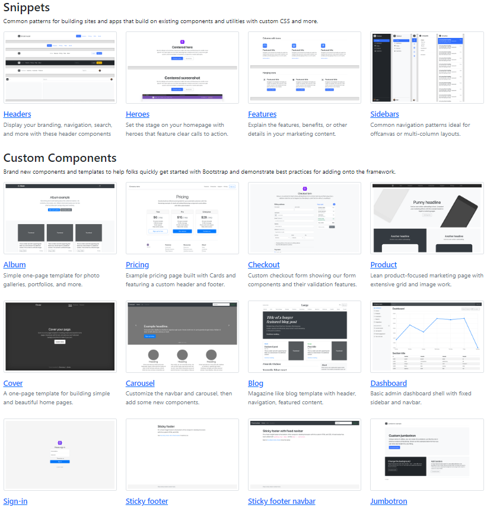
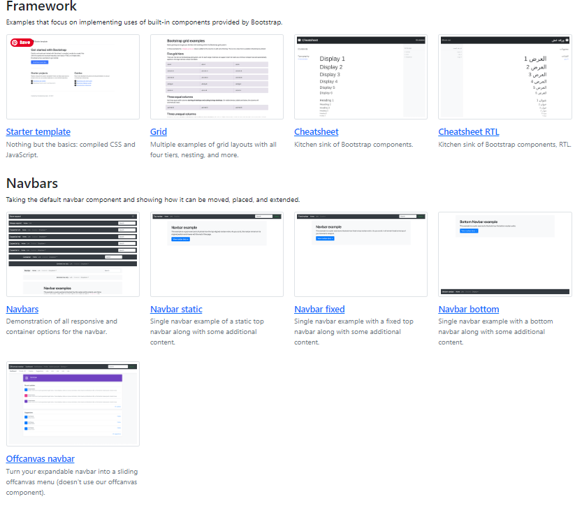

#  Website Templates with JavaScript, Bootstrap, HTML, and CSS
A collection of responsive website templates powered by JavaScript, Bootstrap, HTML, and CSS. Ideal for quick projects or as a foundation for creative ideas.
## Key Features:

- [ ] Responsive design with Bootstrap
- [ ] Dynamic functionality using JavaScript
- [ ] Clean HTML structure
- [ ] Stylish presentation with CSS

### built using:

### The Templates:

 

## 🔗 Connect with me 👩‍💻😊

 

<footer>

Copyright © Shani Bider, 2023

</footer>
